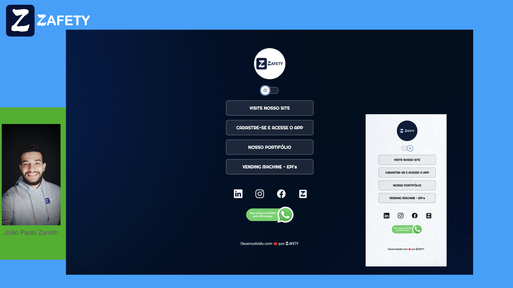

<h1 align="center"> ZAFETY - Ferramentas DIGITAIS de SST </h1>

Projeto LinkTree da ZAFETY com Modo Claro e Modo Escuro  

  <a href="#-HSE">HSE</a>&nbsp;&nbsp;&nbsp;|&nbsp;&nbsp;&nbsp;
  <a href="#-SSMA">SSMA</a>&nbsp;&nbsp;&nbsp;|&nbsp;&nbsp;&nbsp;
  <a href="#-SST">EHS</a>&nbsp;&nbsp;&nbsp;|&nbsp;&nbsp;&nbsp;
  <a href="#-Indústria 4.0">Indústria 4.0</a>

 

  

## 🚀 Tecnologias

Esse projeto foi desenvolvido com as seguintes tecnologias:

- HTML e CSS
- JavaScript
- Git e Github
- Figma
---

Desenvolvido com ♥ by ZAFETY [Visite nosso Site!](https://www.zafety.com.br)
